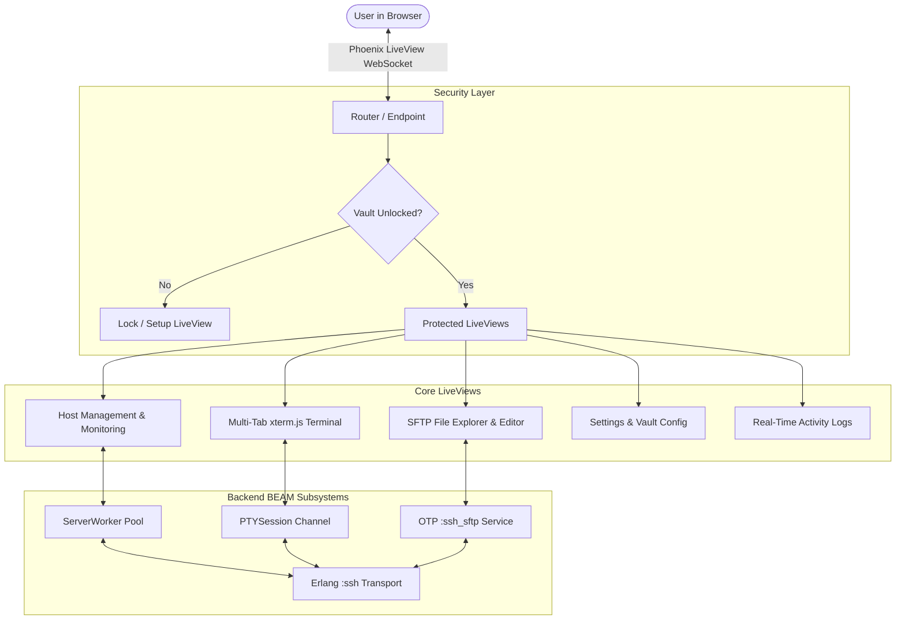

# Design Spec: Master Vault Lock, Native SFTP Explorer, Monitoring Overhaul & Multi-Tab Sessions

**Date**: 2026-09-05  
**Version**: 0.0.1-beta  
**Status**: Proposed / Approved in Principle  

---

## 1. Overview & Architectural Goals

The goal of this architectural revision is to elevate **ssh-client** into a robust, offline-first server management workstation. This release introduces:
1. **Master Password & Vault Lock**: Client-side encrypted credential & session storage (AES-GCM + PBKDF2) with an inactivity lock screen.
2. **Native SFTP File Explorer**: Real-time remote file manager built on Erlang `:ssh_sftp` with directory tree navigation, drag-and-drop file upload/download, and an inline config file editor.
3. **Telemetry & Real-Time Monitoring Fix**: Real CPU/RAM/Disk percentage gauges with multi-threshold visual bars, load averages, and uptime.
4. **Header & UI Polish with "BETA" Tag**: Prominent `BETA` pill badge in header, persistent navigation, and strict **zero-emoji** minimalist design (using SVG icons and monospace badges).
5. **Multi-Tab Terminal Sessions**: Tabbed interface for switching between active terminal shells without connection teardown.

---

## 2. Core Subsystems & Technical Architecture

### 2.1 Master Password & Vault Encryption
- **Module**: `SSHClient.Vault`
- **Key Derivation**: PBKDF2-HMAC-SHA256 with 100,000 iterations and random salt.
- **Symmetric Cipher**: AES-256-GCM.
- **Storage**: Encrypted DETS / JSON store at `~/.config/ssh_client/vault.enc`.
- **State Machine**:
  - `uninitialized`: Prompt user to create a master password on first launch.
  - `locked`: Require master password/PIN to decrypt host credentials and private keys.
  - `unlocked`: Credentials decrypted in memory; timer triggers auto-lock after N minutes of inactivity.
- **LiveView Integration**: `SSHClientWeb.Plugs.EnsureVaultUnlocked` / socket hook redirects to `/lock` when the vault is locked.

### 2.2 Telemetry & Monitoring Subsystem
- **Issue Fix**: Align metric key extraction in `SSHClientWeb.HostLive`:
  - CPU: `get_in(metrics, [:cpu, :used_percent]) || 0.0`
  - RAM: `get_in(metrics, [:memory, :used_percent]) || 0.0`
  - Disk: `get_in(metrics, [:disk, :used_percent]) || 0.0`
  - Load: `get_in(metrics, [:cpu, :load_1])`, `[:cpu, :load_5]`, `[:cpu, :load_15]`
  - Uptime: `metrics[:uptime]`
- **Visual Display**:
  - Compact horizontal gauge bars with color thresholds:
    - Normal (`< 70%`): `#22c55e` (emerald)
    - Warning (`70% – 89%`): `#eab308` (amber)
    - Critical (`>= 90%`): `#ef4444` (red)
  - Action column: Permanent, highly visible button group: `Terminal`, `SFTP`, `Refresh`, `Delete`.

### 2.3 Native SFTP File Explorer
- **Module**: `SSHClient.SFTP` / `SSHClientWeb.SFTPLive` (`/sftp/:id`)
- **Backend**: OTP `:ssh_sftp` client over the existing authenticated SSH connection.
- **Features**:
  - **Directory Browsing**: `list_dir/2` fetching filenames, file types (directory/file/symlink), byte sizes, POSIX permissions (`0644`), and modification timestamps.
  - **Path Navigation**: Breadcrumb bar and direct path input box with auto-complete.
  - **File Operations**:
    - **Download**: Stream remote binary data via LiveView download trigger.
    - **Upload**: Phoenix LiveView `allow_upload` streaming chunks to `:ssh_sftp.write_file/3`.
    - **Inline Editor**: Read file as UTF-8 string into Monaco/xterm text editor; save back with one click.
    - **Create/Delete/Rename**: Standard file operations with confirmation dialogs.

### 2.4 Multi-Tab Terminal & Workspaces
- **Module**: `SSHClientWeb.TerminalLive`
- **Tab Manager**: Tab strip at the top allowing multiple concurrent PTY shells across different hosts or multiple sessions on the same host.
- **Tab State**: Active tabs retained in memory; switching tabs preserves terminal scrollback buffer and shell process.

### 2.5 Strict Design & Aesthetic Guidelines
- **Zero Emojis**: Every emoji across buttons, logs, terminal drawers, and headers is replaced with crisp SVG icons (Heroicons/Lucide paths) or clean monospace badges (`[BETA]`, `[TERM]`, `[SFTP]`, `[LOCK]`, `[RUN]`).
- **Header "BETA" Badge**: Rendered as `BETA`.
- **Palette**: Pitch black background (`#050505`), deep dark panels (`#0a0a0a`, `#111111`), subtle borders (`#1f1f1f`), bright white headings, muted secondary text (`#71717a`).

---

## 3. Data Flow & Component Diagram

---

## 4. Testing & Verification Plan

1. **Vault Lock Tests**:
   - Master password setup, key derivation, AES encryption/decryption validation.
   - Lock/unlock transitions and session timeouts.
2. **Monitoring Verification**:
   - Verify real percentages render in table (CPU, RAM, Disk > 0.0% on active hosts).
   - Verify visual progress bars update dynamically.
3. **SFTP Verification**:
   - List remote directories (`/`, `/var/log`, `/etc`).
   - File download & upload integrity.
   - Inline file editor saves remote file changes.
4. **Emoji Audit**:
   - Comprehensive codebase grep to guarantee zero Unicode emojis in any view or template.
5. **CI & Packaging**:
   - All unit & integration tests pass on GitHub Actions matrix (Windows + Linux).
   - Inno Setup compiles updated `.exe` installer.
